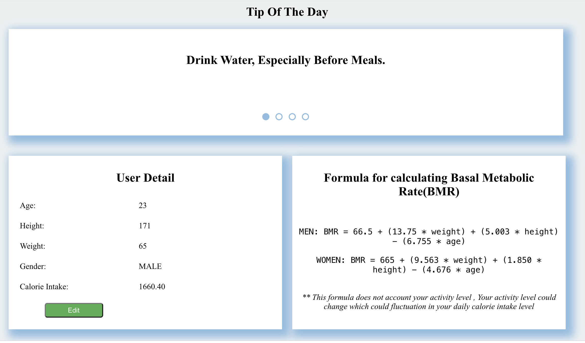
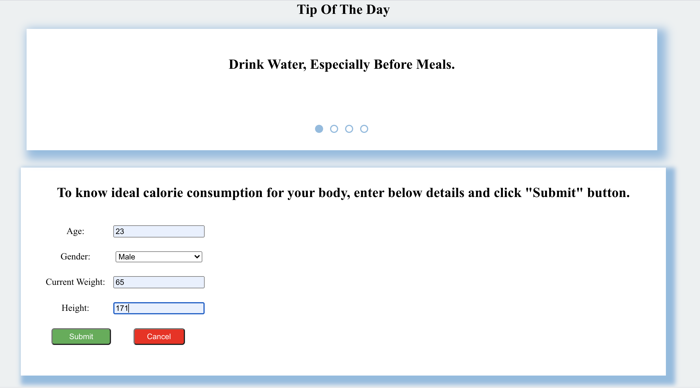
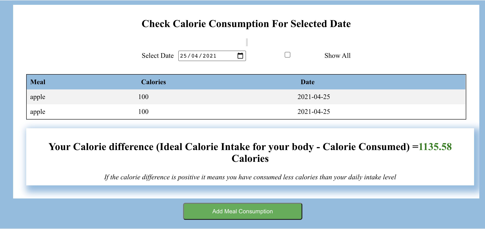

# Calorie Manager
This application provide user to calculate their daily calorie intake and provide tips for fitness and stay healthy.


## Features
1. Calculate ideal calorie consumption for your body considering parameters (Age, Height, Weight, Gender) using below formula which is based on
[Harris–Benedict_equation](https://en.wikipedia.org/wiki/Harris%E2%80%93Benedict_equation) which calculates the BMR (Basal Metabolic Rate)
    - For Men: `BMR = 66.5 + (13.75 * weight) + (5.003 * height) - (6.755 * age)`
    - For Women: `BMR = 665 + (9.563 * weight) + (1.850 * height) - (4.676 * age)`
1. The application lets user log their daily calorie consumption. 
1. The Recorded data is used to calculate the calorie difference which gives user idea whether they are deficit or surplus to the required calorie intake. 
1. The application also provide tips for fitness and staying healthy.

## Technologies Used
1. React, Node, Express.
1. Data persist in memory.

## How to set up application

1. Clone the Repository using ```git clone  https://github.com/seainfo6250/student-dj0894.git```
1. Navigate to project directory ```cd project/CalorieManager```
1. Install dependencies by running command ```npm install``
1. Run application by using command ```npm start```

## Demo
For full demo click [here](https://drive.google.com/file/d/1f1eXkiqhlpBceqcBvoT8h4LjqofvIwt5/view?usp=sharing)


## Screenshots






## Application Testing 
 
 Test Credentials - username: ```testuser``` and password: ```testpass```

## Website Link
Application is also hosted on AWS EC2 and can be accessed using [website link](http://health.prod.deepikajha.me:5000/)

